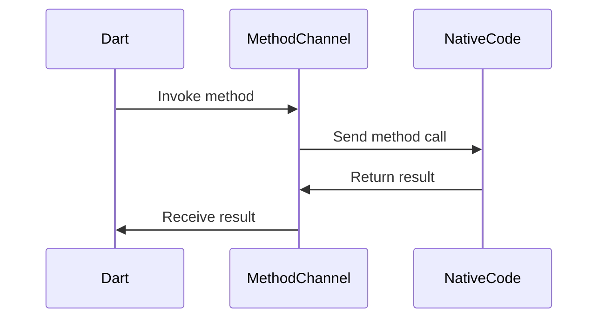

# Platform Channels: When to Build One, When to Find a Package

## The Nightmare at 3AM

It was 3AM, and my pager was blowing up. Our app had just crashed in production, and I was the on-call engineer. As I frantically opened my laptop, my heart sank when I saw the error message: "MissingPluginException: No implementation found for method 'takePhoto'".

I knew exactly what had happened. A few weeks ago, we had built a new feature that allowed users to upload profile photos. It worked great in development, but now it was breaking in the wild. I had to figure out what went wrong, and I had to do it fast.

## The Setup: What I Thought I Knew

As a senior Flutter engineer with 5+ years of experience, I thought I had a solid understanding of platform channels. I knew that they were the mechanism Flutter uses to communicate with the underlying native platforms (Android and iOS). I had used them before to integrate with various native APIs, and I had even built a few custom platform channels myself.

But as I dug into the issue, I quickly realized that my understanding was far from complete. There were nuances and edge cases that I had never encountered, and they were coming back to haunt me.

## What's Actually Happening Under the Hood

At the core of platform channels is the `MethodChannel` class, which is part of the `flutter/services.dart` package. This class provides a way to invoke native methods and receive responses back in Dart.

When you call a method on a `MethodChannel`, Flutter sends a message to the native platform, which then executes the corresponding native code and sends the result back to Dart. This communication happens over a platform-specific implementation, which can be either a `MethodCodec` (for method calls) or a `MessageCodec` (for more general message passing).

The key thing to understand is that the native implementation of the platform channel is not provided by Flutter. Instead, it's up to the developer to implement the native side of the channel. This is where things can get tricky.

**Diagram: Platform Channel Communication Flow**



## Why It Works This Way

The reason Flutter takes this approach is to maintain a clear separation of concerns between the Dart and native code. By not providing the native implementation, Flutter can focus on the cross-platform abstraction layer, while developers can tailor the native behavior to their specific needs.

This design choice also allows for better performance. By avoiding the need to bridge between Dart and native code for every operation, platform channels can be more efficient than alternative approaches, such as using a WebView or a native module.

However, this flexibility comes with a trade-off: the developer is responsible for ensuring that the native implementation is correct and robust. This is where many developers, including myself, have run into issues.

## The Common Pitfalls

### Pitfall #1: Forgetting to Implement the Native Side
One of the most common mistakes I've seen is developers forgetting to implement the native side of the platform channel. This can happen when you're quickly prototyping a feature or when you're using a third-party package that relies on a platform channel.

In my case, the `takePhoto` method was part of a third-party package we were using for the photo upload feature. I had assumed that the package would handle the native implementation, but it turns out that it was my responsibility to do so.

**The Scenario:**
```dart
// ❌ The bug/mistake
Future<String> takePhoto() async {
  final result = await _channel.invokeMethod<String>('takePhoto');
  return result!;
}
```

**The Problem:**
When I called the `takePhoto` method, Flutter would send the message to the native platform, but there was no corresponding native code to handle it. This resulted in the `MissingPluginException` that crashed my app.

**The Lesson:**
Always make sure that the native implementation of a platform channel exists and is correctly implemented. If you're using a third-party package, read the documentation carefully to understand what you need to do on the native side.

### Pitfall #2: Ignoring Version Differences
Another common pitfall is ignoring version-specific behavior in platform channels. The way platform channels work can change between Flutter versions, and if you're not aware of these changes, you can run into unexpected issues.

For example, in Flutter 3.0, the behavior of `MethodChannel.invokeMethod` changed. Before 3.0, if the native method returned `null`, the Dart method would also return `null`. But in Flutter 3.0, the Dart method would throw a `PlatformException` instead.

**The Scenario:**
```dart
// ❌ The bug/mistake (pre-Flutter 3.0)
Future<String?> takePhoto() async {
  final result = await _channel.invokeMethod<String>('takePhoto');
  return result;
}
```

**The Problem:**
In Flutter 3.0, this code would start throwing `PlatformException` instead of returning `null`, which would break existing callers of the `takePhoto` method.

**The Lesson:**
Always be aware of version-specific changes in the Flutter framework. When upgrading Flutter, carefully review the release notes and update your code accordingly.

### Pitfall #3: Mishandling Asynchronous Behavior
Platform channels are inherently asynchronous, which means you need to be careful when dealing with the flow of execution in your Dart code.

One common mistake I've seen is forgetting to `await` the result of a platform channel invocation. This can lead to race conditions and unexpected behavior.

**The Scenario:**
```dart
// ❌ The bug/mistake
void handleSubmit() {
  _channel.invokeMethod('submitData', data);
  setState(() => isLoading = false);
}
```

**The Problem:**
In this case, the `setState` call would run immediately, even though the native `submitData` method might still be in progress. This could result in the UI showing an incorrect loading state.

**The Lesson:**
Always `await` the result of a platform channel invocation before updating the UI or performing any other actions that depend on the native call's completion.

```dart
// ✅ The fix
Future<void> handleSubmit() async {
  setState(() => isLoading = true);
  await _channel.invokeMethod('submitData', data);
  if (!mounted) return;
  setState(() => isLoading = false);
}
```

By awaiting the platform channel invocation, we ensure that the UI state is updated correctly, and we also handle the case where the widget might have been disposed before the native call completed.

## How to Do It Right

Based on the lessons I've learned from my own mistakes and the issues I've seen in production apps, here are some best practices for working with platform channels:

1. **Implement the Native Side Carefully**: Spend time ensuring that the native implementation of your platform channel is correct and robust. Test edge cases, handle errors, and document your API clearly.

2. **Use Packages When Possible**: Before building a custom platform channel, see if there's an existing package that provides the functionality you need. This can save you a lot of time and effort.

3. **Manage Asynchronous Behavior**: Always `await` the result of a platform channel invocation, and be mindful of the flow of execution in your Dart code.

4. **Stay Up-to-Date with Flutter Versions**: Keep an eye on the Flutter release notes and update your code accordingly when upgrading the framework.

5. **Instrument Your Platform Channels**: Add logging, error handling, and performance monitoring to your platform channels to help with debugging and troubleshooting in production.

6. **Separate Concerns**: Try to keep your platform channel implementations focused on a single, well-defined task. This makes them easier to test, maintain, and reuse.

7. **Favor Simplicity**: When possible, prefer simpler solutions over more complex ones. Complex platform channels can be harder to debug and maintain.

## Practical Application: Integrating with Native APIs

Let's look at a real-world example of how to use platform channels to integrate with a native API.

**The Scenario:**
In one of our apps, we needed to integrate with the native calendar API to allow users to create and manage events. We decided to build a custom platform channel for this functionality, as there wasn't a suitable package available.

**The Setup:**
We started by creating a `CalendarChannel` class in our Dart code, which wraps the underlying `MethodChannel`:

```dart
class CalendarChannel {
  static const _name = 'calendar_channel';
  static final _channel = MethodChannel(_name);

  static Future<void> createEvent(CalendarEvent event) async {
    await _channel.invokeMethod('createEvent', event.toMap());
  }

  static Future<List<CalendarEvent>> getEvents() async {
    final events = await _channel.invokeMethod<List<dynamic>>('getEvents');
    return events?.map((e) => CalendarEvent.fromMap(e)).toList() ?? [];
  }
}
```

**The Native Implementation:**
On the native side, we implemented the `createEvent` and `getEvents` methods for both Android and iOS. Here's an example of the Android implementation:

```kotlin
class CalendarPlugin(private val activity: Activity) : MethodCallHandler {
    override fun onMethodCall(call: MethodCall, result: Result) {
        when (call.method) {
            "createEvent" -> createEvent(call.arguments as Map<String, Any>)
            "getEvents" -> getEvents(result)
            else -> result.notImplemented()
        }
    }

    private fun createEvent(arguments: Map<String, Any>) {
        // Implementation to create a calendar event
    }

    private fun getEvents(result: Result) {
        // Implementation to fetch calendar events
        result.success(events.map { it.toMap() })
    }
}
```

**The Lesson:**
By building a custom platform channel, we were able to encapsulate the native calendar API integration and provide a clean, cross-platform API for our Flutter app. This allowed us to easily extend the functionality as needed and maintain a consistent user experience across both Android and iOS.

## Trade-offs & Alternatives

While platform channels are a powerful tool for integrating with native functionality, they're not always the best solution. There are trade-offs to consider, and in some cases, alternative approaches may be more appropriate.

**Trade-offs:**
- **Complexity**: Building a custom platform channel requires implementing the native side, which can be time-consuming and error-prone.
- **Maintenance**: You're responsible for maintaining the native implementation, which can be a burden, especially if you need to support multiple platforms.
- **Performance**: While platform channels are generally efficient, they still involve some overhead due to the message passing between Dart and native code.

**Alternatives:**
1. **Use Packages**: If there's an existing package that provides the functionality you need, it's often better to use that instead of building a custom platform channel.
2. **Implement in Dart**: For some use cases, you may be able to implement the functionality entirely in Dart, without the need for a platform channel.
3. **Use Plugins**: Flutter's plugin system provides a more structured way to integrate native functionality, with built-in support for things like dependency management and platform-specific configuration.

Ultimately, the decision of whether to build a platform channel or use an alternative approach depends on the specific requirements of your app and the trade-offs you're willing to accept.

## Key Takeaway

The key lesson I've learned from my experiences with platform channels is the importance of understanding the underlying mechanics and being prepared for the challenges that come with them.

Platform channels are a powerful tool, but they require careful implementation and attention to detail. By understanding the nuances of how they work, anticipating common pitfalls, and following best practices, you can build robust and reliable integrations with native functionality.

The next time you're faced with a platform-specific requirement, don't just jump to building a custom platform channel. Take the time to evaluate your options, consider the trade-offs, and make an informed decision. And if you do decide to build a platform channel, approach it with the same level of care and attention that you would any other critical component of your application.