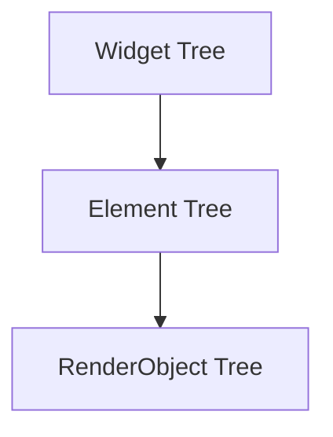

BuildContext Isn't a Context. It's a Handle to the Element Tree.

## The 3am Debugging Session

It was 3am, and I was staring at my laptop, trying to figure out why my app's UI wasn't updating the way I expected. I had a user-facing feature that was supposed to show a loading spinner while an API request was in flight, but instead, the spinner was disappearing immediately after I called `setState()`. 

"Weird," I thought. "I'm calling `setState()`, so why isn't the UI rebuilding?"

I stepped through the code, double-checked my logic, and even added some extra logging. But no matter what I tried, the spinner would flash on the screen for a split second and then vanish. I was convinced there was some kind of race condition or asynchronous issue, but I couldn't figure out what was going on.

After hours of frustrated debugging, I finally stumbled upon the root cause: I was calling `setState()` in the wrong place. The `BuildContext` I was using to trigger the rebuild was no longer valid by the time the API request completed.

That night, I learned a valuable lesson about the true nature of `BuildContext` – it's not a "context" at all, but rather a handle to the underlying Element tree. And understanding this distinction is crucial for writing robust, maintainable Flutter apps.

## What You (Probably) Think You Know

If you've been working with Flutter for a while, you've probably heard the term "BuildContext" thrown around a lot. The docs describe it as a "handle to the location of a widget in the widget tree," and they emphasize that you should always use the `BuildContext` passed into your widget's `build()` method to interact with the framework.

And that's mostly true. `BuildContext` is indeed a handle to the widget tree, and you do need to use it to access certain framework functionality, like calling `Navigator.push()` or looking up a `Theme`. But the way most developers think about `BuildContext` is overly simplistic.

The common mental model is that `BuildContext` represents some kind of "context" or "environment" for your widget – a container of information about where your widget lives in the app. And while that's not entirely wrong, it's a vast oversimplification of what's actually happening under the hood.

## What's Actually Happening Under the Hood

To understand the true nature of `BuildContext`, we need to take a closer look at how Flutter's widget system works. At the core of Flutter is the **Widget Tree** – a hierarchical structure of widgets that describe the UI of your app. But the Widget Tree isn't the only tree in town. There's also the **Element Tree**, which is Flutter's internal representation of the Widget Tree.

When you call `runApp()` or `build()` on a widget, Flutter creates a corresponding **Element** in the Element Tree. This Element is responsible for managing the lifecycle of the widget, handling user input, and coordinating the rendering process.

The `BuildContext` you receive in your widget's `build()` method is essentially a **handle** to this Element. It's a reference that allows you to interact with the Element and, by extension, the widget it represents.

Here's what the relationship looks like:



The Widget Tree describes the structure of your UI, the Element Tree manages the lifecycle and state of those widgets, and the RenderObject Tree is responsible for the actual rendering and layout.

When you call `setState()` or access the `Theme` using `Theme.of(context)`, you're not interacting with the Widget Tree directly. Instead, you're working with the Element that corresponds to your widget, using the `BuildContext` as a way to reference that Element.

## Why It Works This Way

So, why did the Flutter team choose this approach? There are a few key reasons:

1. **Performance**: By separating the Widget Tree from the Element Tree, Flutter can avoid unnecessary rebuilds and optimize the rendering process. The Element Tree acts as an intermediary, managing the state and lifecycle of widgets without having to constantly rebuild the entire Widget Tree.

2. **Flexibility**: The Element Tree allows Flutter to add features and functionality that wouldn't be possible if the framework was tightly coupled to the Widget Tree. Things like global keys, focus management, and accessibility are all built on top of the Element Tree.

3. **Consistency**: By providing a consistent `BuildContext` interface, Flutter can ensure that all widgets interact with the framework in a predictable way, regardless of their position in the Widget Tree.

In other words, the `BuildContext` isn't a "context" in the traditional sense – it's a handle to a specific Element in the Element Tree. And understanding this distinction is crucial for writing robust, maintainable Flutter apps.

## The Common Pitfalls

Now that we know `BuildContext` is a handle to the Element Tree, let's look at some common pitfalls that arise from misunderstanding this concept.

**Pitfall #1: Assuming `BuildContext` is always valid**

The most common mistake I see is developers assuming that the `BuildContext` passed into a widget's `build()` method will always be valid. But the reality is that `BuildContext` can become invalid if the widget is removed from the tree or if the widget's parent is rebuilt.

This is exactly what happened in my 3am debugging session. I was calling `setState()` to update the UI, but by the time the API request completed, the `BuildContext` I was using was no longer valid. The widget had been removed from the tree, and my `setState()` call was effectively a no-op.

To avoid this, you need to always check if the `BuildContext` is still valid before using it. You can do this by calling the `mounted` getter on the `BuildContext`:

```dart
Future<void> handleSubmit() async {
  setState(() => isLoading = true);
  await api.submit(data);
  if (!mounted) return;
  setState(() => isLoading = false);
}
```

**Pitfall #2: Trying to access global state using `BuildContext`**

Another common mistake is trying to use `BuildContext` to access global state or services. Since `BuildContext` is a handle to a specific Element in the tree, it doesn't have a direct connection to the app-level state or services.

For example, you might be tempted to do something like this:

```dart
void handleSubmit(BuildContext context) {
  final user = context.read<UserProvider>(); // ❌ This won't work!
  api.submit(user.data);
  setState(() => isLoading = false);
}
```

But this won't work because the `BuildContext` doesn't have a direct reference to the `UserProvider`. Instead, you should use a dependency injection system like Provider or Riverpod to access your app-level state and services.

**Pitfall #3: Overusing `BuildContext`**

While `BuildContext` is an important part of the Flutter framework, it's possible to overuse it and make your code harder to understand and maintain.

For example, I've seen developers try to pass `BuildContext` all the way down the widget tree, just in case they might need it later. But this can lead to cluttered method signatures and make it harder to reason about the dependencies of your widgets.

Instead, try to minimize the use of `BuildContext` and only pass it down the tree when you know you'll need it. And if you find yourself needing to access the same information from multiple places, consider using a state management solution or dependency injection to make your code more modular and testable.

## Practical Application

Now that we have a deeper understanding of what `BuildContext` really is, let's look at some real-world examples of how this knowledge can be applied.

**Scenario 1: Navigating the app**

One of the most common use cases for `BuildContext` is navigating the app using the `Navigator` class. Here's an example of how to do this correctly:

```dart
void handleSubmit(BuildContext context) async {
  setState(() => isLoading = true);
  try {
    await api.submit(data);
    if (!mounted) return;
    Navigator.of(context).pushNamed('/success');
  } catch (e) {
    if (!mounted) return;
    ScaffoldMessenger.of(context).showSnackBar(
      SnackBar(content: Text('Error: $e')),
    );
  } finally {
    if (!mounted) return;
    setState(() => isLoading = false);
  }
}
```

Notice how we're using `Navigator.of(context)` and `ScaffoldMessenger.of(context)` to access global navigation and snackbar functionality. This is possible because these methods are designed to work with the `BuildContext` and the underlying Element tree.

However, if we tried to use `context.read<UserProvider>()` in this example, it wouldn't work because the `BuildContext` doesn't have a direct reference to the `UserProvider`. We'd need to use a state management solution like Provider or Riverpod to access that global state.

**Scenario 2: Accessing the Theme**

Another common use case for `BuildContext` is accessing the app's theme information. Here's an example:

```dart
Widget build(BuildContext context) {
  final theme = Theme.of(context);
  return Container(
    color: theme.colorScheme.primary,
    child: Text(
      'Hello, world!',
      style: theme.textTheme.headline4,
    ),
  );
}
```

In this case, we're using the `Theme.of(context)` method to retrieve the current theme information and apply it to our widget. This works because the `Theme` widget is designed to work with the `BuildContext` and the Element tree.

However, if we tried to use `context.read<ThemeProvider>()` instead, it wouldn't work for the same reason as the previous example. The `BuildContext` doesn't have a direct reference to the `ThemeProvider`.

## Trade-offs and Alternatives

While understanding the true nature of `BuildContext` is important, it's also worth considering some alternative approaches and trade-offs.

**Trade-off: Increased Complexity**

The separation of the Widget Tree and the Element Tree, while beneficial for performance and flexibility, does add some complexity to the Flutter framework. Developers need to understand the distinction between these two trees and how `BuildContext` fits into the picture.

This increased complexity can make it harder for newcomers to understand the framework and can also lead to more potential points of failure in your code (e.g., using an invalid `BuildContext`).

**Alternative: Simpler Approaches**

For simpler apps or prototypes, you may not need to worry too much about the intricacies of `BuildContext`. In these cases, you can often get away with a more straightforward approach, like using global state management or relying more heavily on the Widget Tree.

However, as your app grows in complexity, understanding the role of `BuildContext` and the Element Tree becomes increasingly important for writing robust, maintainable code.

**Alternative: More Powerful Abstractions**

Another alternative is to use more powerful abstractions that encapsulate the complexity of the Element Tree and `BuildContext`. Frameworks like Riverpod and GetIt provide dependency injection solutions that make it easier to access global state and services without having to worry about the underlying `BuildContext` mechanics.

These abstractions can help simplify your code and make it more testable, but they also come with their own trade-offs and learning curves.

## Key Takeaway

The key takeaway from this deep dive is that `BuildContext` is not a "context" in the traditional sense – it's a handle to a specific Element in the Element Tree. Understanding this distinction is crucial for writing robust, maintainable Flutter apps.

When you're working with `BuildContext`, always remember to:

1. Check if the `BuildContext` is still valid before using it.
2. Avoid trying to access global state or services directly through `BuildContext`.
3. Minimize the use of `BuildContext` and only pass it down the tree when you know you'll need it.

By keeping these principles in mind, you can avoid common pitfalls and write Flutter apps that are more reliable, testable, and easier to reason about.